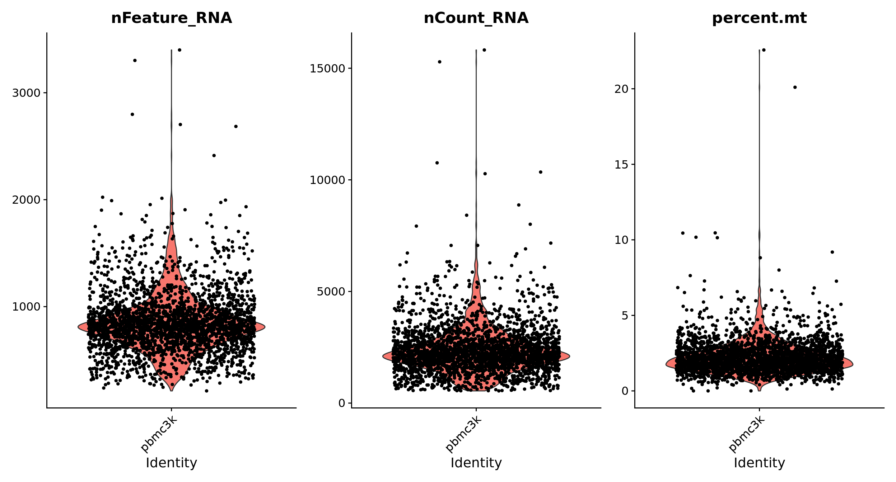
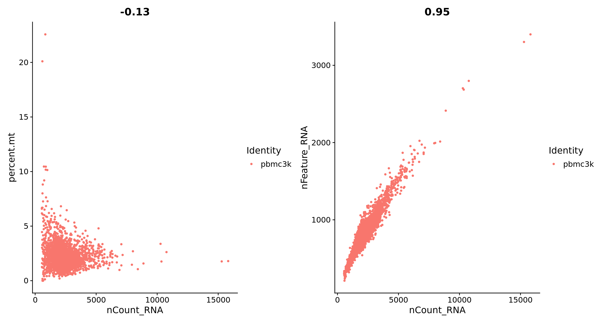
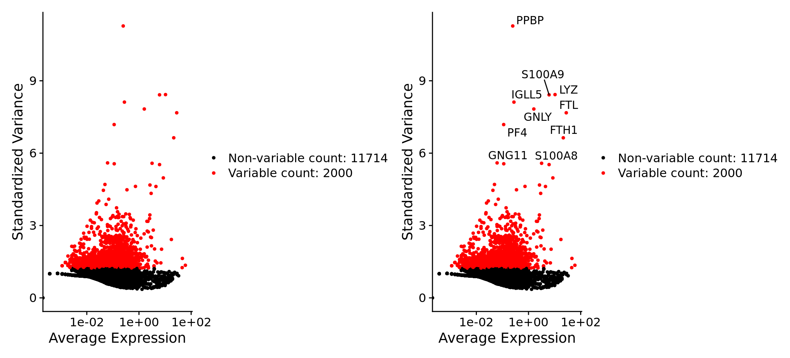
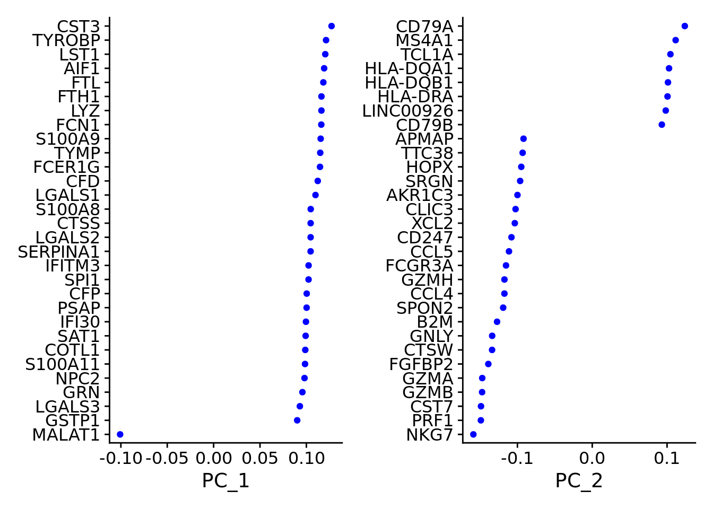
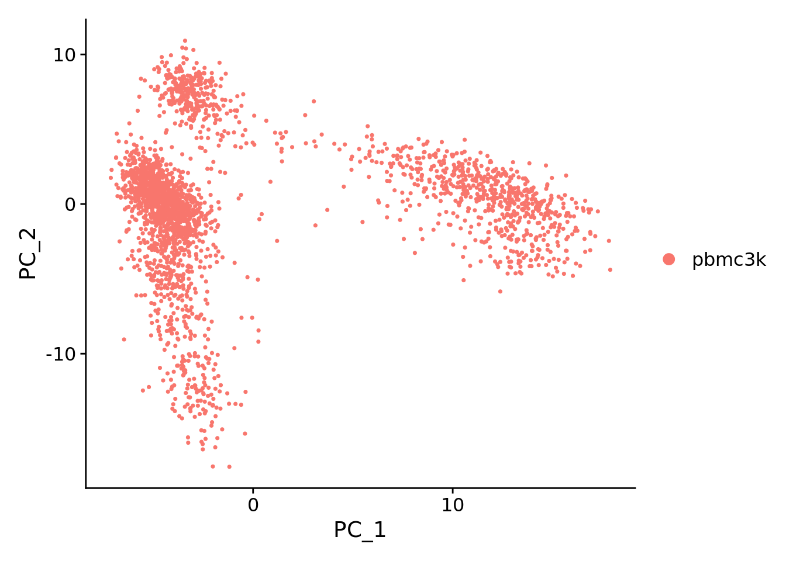
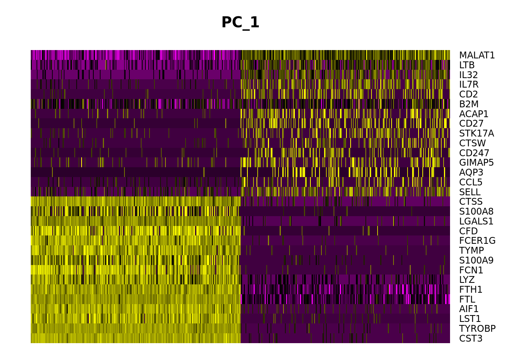
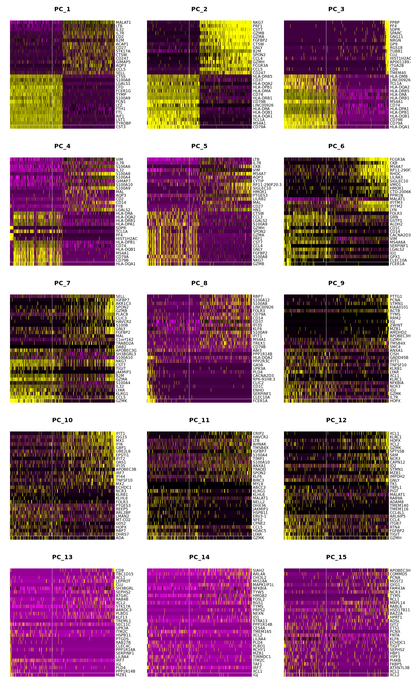
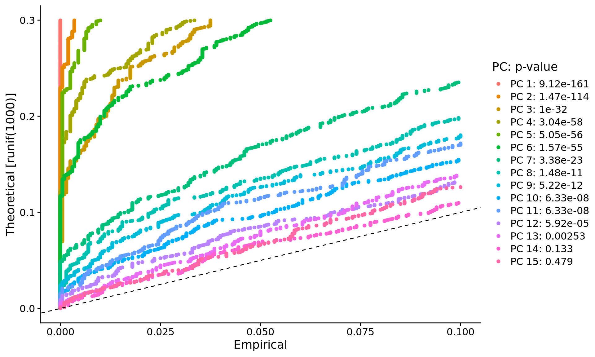
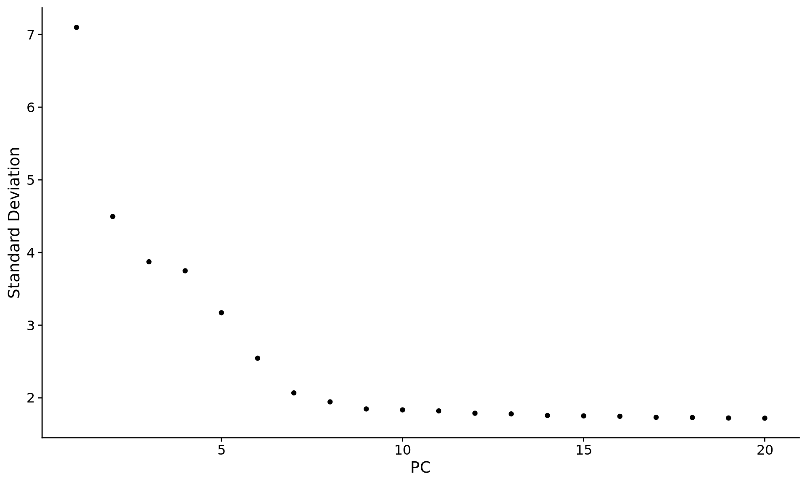

[https://satijalab.org/seurat/](https://satijalab.org/seurat/)

Seurat 은 scRNAseq data의 QC(quality check), analysis에 사용되는 R package이다.

> **Installing Seurat**
> 

```bash
# Enter commands in R (or R studio, if installed)
install.packages('Seurat')
library(Seurat)
```

> **Tutorial**
> 
- Setup the Seurat Object
    
    튜토리얼에서는 10XGenomics의 [Peripheral Blood Mononuclear Cells (PBMC) datasets](https://cf.10xgenomics.com/samples/cell/pbmc3k/pbmc3k_filtered_gene_bc_matrices.tar.gz)을 사용할 것이다. Seurat Object의 구조는 [GitHub Wiki](https://github.com/satijalab/seurat/wiki/Seurat)에서 확인할 수 있다. count matrix는 pbmc[["RNA"]]@counts에 저장된다.
    
    ```bash
    library(dplyr)
    library(Seurat)
    library(patchwork)
    
    # PBMC dataset을 로드한다
    pbmc.data <- Read10X(data.dir = "../data/pbmc3k/filtered_gene_bc_matrices/hg19/")
    
    # Seurat object 초기화 (non-normalized data).
    pbmc <- CreateSeuratObject(counts = pbmc.data, project = "pbmc3k", min.cells = 3, min.features = 200)
    
    pbmc
    ## An object of class Seurat 
    ## 13714 features across 2700 samples within 1 assay 
    ## Active assay: RNA (13714 features, 0 variable features)
    ```
    
- QC and selecting cells for further analysis
    
    사용자가 임의적으로 QC 기준을 지정할 수 있다. QC를 할 때는 아래와 같은 특징들을 고려한다.
    
    - 각 세포의 gene 수
        - Low-quality cells or empty droplets은 적은 gene을 가진다.
        - Cell doublets or multiplets은 많은 gene을 가질 것이다.
    - mitochondrial genome의 reads 비율
        - Low-quality / dying cells 은 mitochondraial reads 비율이 높다.
        - mitochondrial QC metrics 는 `PercentageFeatureSet` function을 이용해 계산한다.
        - `MT-` 로 시작하는 gene은 set of mitochondrial genes
    
    ```bash
    # [[ 연산자는 metadata에 열을 추가한다. This is a great place to stash QC stats
    pbmc[["percent.mt"]] <- PercentageFeatureSet(pbmc, pattern = "^MT-")pbmc
    ```
    
    튜토리얼에서는 이러한 세포들을 filtering 할 것이다.
    
    - unique feature counts over 2,500 or less than 200
    - 5% 이상 mitochondrial counts
    
    ```bash
    # QC metrics 시각화(violin plot) -> raw sample의 분포 확인가능
    VlnPlot(pbmc, features = c("nFeature_RNA", "nCount_RNA", "percent.mt"), ncol = 3)
    ```
    
    
    
    ```bash
    # FeatureScatter는 feature-feature relationships 시각화에 주로 쓰인다.
    plot1 <- FeatureScatter(pbmc, feature1 = "nCount_RNA", feature2 = "percent.mt")
    plot2 <- FeatureScatter(pbmc, feature1 = "nCount_RNA", feature2 = "nFeature_RNA")
    plot1 + plot2
    ```
    
   
    
    ```bash
    pbmc <- subset(pbmc, subset = nFeature_RNA > 200 & nFeature_RNA < 2500 & percent.mt < 5)
    ```
    
- Normalizing the data
    
    데이터셋에서 quality가 낮은 cell들을 filter했으면 이제 정규화를 할 차례다. 기본적으로는 LogNormalize 방법을 이용한다. 정규화된 결과는 pbmc[["RNA"]]@data에 저장된다.
    
    ```bash
    # 위 명령어를 간단하게 아래의 명령어로 실행한다.
    pbmc <- NormalizeData(pbmc, normalization.method = "LogNormalize", scale.factor = 10000)
    pbmc <- NormalizeData(pbmc)
    ```
    
- Identification of highly variable features (feature selection)
    
    다음으로 dataset에서 cell간 variation이 높은 feature를 selection하자. FindVariableFeatures funtion을 주로 사용하여 2,000개의 feature들을 골라 downstream 분석에 이용한다.
    
    ```bash
    pbmc <- FindVariableFeatures(pbmc, selection.method = "vst", nfeatures = 2000)
    
    # 10개의 가장 variable genes
    top10 <- head(VariableFeatures(pbmc), 10)
    
    # plot variable features with and without labels
    plot1 <- VariableFeaturePlot(pbmc)
    plot2 <- LabelPoints(plot = plot1, points = top10, repel = TRUE)
    plot1 + plot2
    ```
    
    
    
- Scaling the data
    
    PCA와 같은 dimensional reduction을 수행하기 전 scaling을 통해 linear transformation 과정이 필요하다. 
    
    ScaleData function:
    
    - 각 gene expression의 평균을 0으로 만든다.
    - 각 gene expression의 분산을 0으로 만든다.
        - 높게 발현이 나타나도 dominate하지 않게 만들어서 bias가 없게한다.
    - 결과는 pbmc[["RNA"]]@scale.data에 저장된다.
    
    ```bash
    all.genes <- rownames(pbmc)
    pbmc <- ScaleData(pbmc, features = all.genes)
    ```
    
- Perform linear dimensional reduction
    
    scaled 된 variable feature만 가지고 PCA분석을 해보자.
    
    ```bash
    pbmc <- RunPCA(pbmc, features = VariableFeatures(object = pbmc))
    
    # positive, negative 각 5개씩 나타내기 
    print(pbmc[["pca"]], dims = 1:5, nfeatures = 5)
    
    ## PC_ 1 
    ## Positive:  CST3, TYROBP, LST1, AIF1, FTL 
    ## Negative:  MALAT1, LTB, IL32, IL7R, CD2 
    ## PC_ 2 
    ## Positive:  CD79A, MS4A1, TCL1A, HLA-DQA1, HLA-DQB1 
    ## Negative:  NKG7, PRF1, CST7, GZMB, GZMA 
    ## PC_ 3 
    ## Positive:  HLA-DQA1, CD79A, CD79B, HLA-DQB1, HLA-DPB1 
    ## Negative:  PPBP, PF4, SDPR, SPARC, GNG11 
    ## PC_ 4 
    ## Positive:  HLA-DQA1, CD79B, CD79A, MS4A1, HLA-DQB1 
    ## Negative:  VIM, IL7R, S100A6, IL32, S100A8 
    ## PC_ 5 
    ## Positive:  GZMB, NKG7, S100A8, FGFBP2, GNLY 
    ## Negative:  LTB, IL7R, CKB, VIM, MS4A7
    ```
    
    Seurat에서는 PCA관련 분석을 위한 VizDimReduction, DimPlot, and DimHeatmap등의 함수를 제공한다.
    
    ```bash
    # 각 feature가 pc에서 분산에 비중이 얼마나 큰지 나타낸다. -와 +는 방향을 나타냄
    VizDimLoadings(pbmc, dims = 1:2, reduction = "pca")
    ```
    
    
    
    ```bash
    DimPlot(pbmc, reduction = "pca")
    ```
    
    
    
    DimHeatmap function을 통해 dataset의 heterogeneity를 분석할 수 있고 pc선택에 유용하다. cell과 feature는 PCA score순으로 정렬되어 있다. cells 파라미터로 양 극단의 몇개의 cell을 보여줄 지 설정할 수 있다.
    
    ```bash
    DimHeatmap(pbmc, dims = 1, cells = 500, balanced = TRUE)
    ```
    
    
    
    ```bash
    DimHeatmap(pbmc, dims = 1:6, cells = 500, balanced = TRUE)
    ```
    
    
    
- Determine the 'dimensionality' of the dataset
    
     scRNAseq 데이터를 분석함에 있어서 feature 선택에 의한 노이즈를 줄이기 위해서 Seurat은 metafeature로 만든 pc들로 PCA를 분석한다. 이때 몇개의 component를 포함시킬지 논의가 필요하다. 
    
     [Macosko et al](https://www.cell.com/fulltext/S0092-8674(15)00549-8)에서는 JackStraw procedure resampling test를 수행했는데, 1%의 random subset으로 PCA를 반복 수행하여 pc의 p-value를 측정하였다. 
    
    ```bash
    # NOTE: 이 과정은 데이터 크기에 따라 시간이 오래걸릴 수 있다.
    pbmc <- JackStraw(pbmc, num.replicate = 100)
    pbmc <- ScoreJackStraw(pbmc, dims = 1:20)
    ```
    
    JackStrawPlot function은 각 pc의 p-values의 분포를 비교하는 시각화 툴이다. ~~'Significant' pc는 낮은 p-values와 strong enrichment를 보인다(solid curve above the dashed line). 이 예시에서는 the first 10-12 PCs 다음에 sharp drop-off가 보인다.~~
    
    ```bash
    JackStrawPlot(pbmc, dims = 1:15)
    ```
    
    
    
    다른 heuristic method 에는 Elbow plot이 있다. Elbow plot은 각 pc의 분산에 대한 비중을 기준으로 분석한다 (ElbowPlot function). 예시에서는 PC9-10 사이에서 elbow를 볼 수 있는데, ~~suggesting that the majority of true signal is captured in the first 10 PCs.~~
    
    ```bash
    ElbowPlot(pbmc)
    ```
    
    