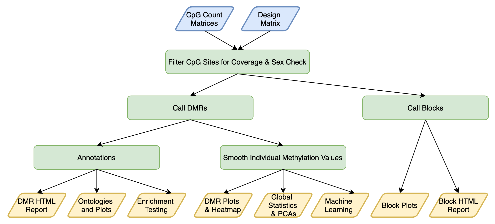

l# MethylSeq_Analysis_EHB202110
Building Analysis Pipeline for WGBS(Whole Genome Bisulfite Sequencing) Data

## **1. Fastq random sampling (Optional)** ##
github(https://github.com/lh3/seqtk)  
If WGBS data is too big, it need to be sampled.

### 1.1 Install seqtk ###
```shell-script
git clone https://github.com/lh3/seqtk.git;
cd seqtk; make
```
### 1.2 Random sampling by read number ###
**Tip!**  
You should decompress your fastq.gz to fastq format  
You should use same seed number for paired-end fastq

```shell-script
seqtk sample -s [seed number] [fastq file name] [read number] > [output file name]
#example
seqtk sample -s123 test_R1.fastq 100000 > sub_test_R2.fastq 
```

## **2. bismark** ##
github(https://github.com/FelixKrueger/Bismark)  
Bismark is a program to map bisulfite treated sequencing reads to a genome of interest and perform methylation calls in a single step

**Bismark's main features**
- Bisulfite mapping and methylation calling in one single step
- Supports single-end and paired-end read alignments
- Supports ungapped and gapped alignments
- Alignment seed length, number of mismatches etc. are adjustable
- Output discriminates between cytosine methylation in CpG, CHG and CHH context

**Requirements for bismark**
- `<Bowtie2>` or `<HISAT2>`
- `<Samtools>`

### 2.1 Install `bismark` ###
Download source code on [release page](https://github.com/FelixKrueger/Bismark/releases)
```shell-script
cd ~/ehbaek/bismark/Resource
git clone https://github.com/FelixKrueger/Bismark.git
```
### 2.2 Running `bismark_genome_preparation` ###
Make your own reference genome prepared for using bismark  
**Need to run once at first**
```shell-script
bismark_genome_preparation [options] <path_to_genome_folder>
```
example
```shell-script
bismark_genome_preparation /media/src/ref/b37/
```

### 2.3 Running `bismark` (mapping) ###

```shell-script
bismark [options] --genome <genome_folder> {-1 <mates1> -2 <mates2> | <singles>}
```
example
```shell-script
bismark -q --parallel 8 --bam --genome /media/src/ref/b37/ -1 test_R1.fastq -2 test_R2.fastq

```
### 2.4 Running `deduplicate_bismark` ###
```shell-script
deduplicate_bismark --bam [options] <filenames>
```
example
```shell-script
deduplicate_bismark --bam -p -o test test_bismark_bt2_pe.bam
```
### 2.5 Running `bismark_methylation_extractor` ###
```shell-script
bismark_methylation_extractor [options] <filenames>
```
example
```shell-script
bismark_methylation_extractor -p --parallel 8 --ucsc --bedGraph --comprehensive --cytosine_report --gzip --genome_folder /media/src/ref/b37/ test.deduplicated.bam
```
### 2.6 Running `bismark2report` ###
```shell-script
bismark2report [options]
```
### 2.7 Running `bismark2summary`
```shell-script
bismark2summary [options]
```

## **3. DMRichR** ##
github(https://github.com/ben-laufer/DMRichR/tree/master/man/figures)

`DMRichR` is an R package and executable for the preprocessing, statistical analysis, and visualization of differentially methylated regions (DMRs) and global methylation levels from CpG count matrices (Bismark cytosine reports).

`DMRichR::DM.R()` is a single function that performs all of the following steps:  



### 3.1 Install DMRichR ###

**R version: R-4.0.5**
```R
if(!requireNamespace("BiocManager", quietly = TRUE))
  install.packages("BiocManager")
if(!requireNamespace("remotes", quietly = TRUE))
  install.packages("remotes")
Sys.setenv("R_REMOTES_NO_ERRORS_FROM_WARNINGS" = TRUE)
BiocManager::install("ben-laufer/DMRichR")
if(R.Version()$major < 4)
  install.packages("dmrseq", repos = "https://bioconductor.org/packages/3.12/bioc")
 ```

### 3.1 Working Directory Structure ###
Before running the executable, ensure you have the following project directory tree structure for the cytosine reports and design matrix:  

```
├── Project
│   ├── sample1_bismark_bt2.deduplicated.bismark.cov.gz.CpG_report.txt.gz
│   ├── sample2_bismark_bt2.deduplicated.bismark.cov.gz.CpG_report.txt.gz
│   ├── sample_info.xlsx
```

### 3.2 sample_info.xlsx ###
This script requires a basic design matrix to identify the groups and covariates, which should be named sample_info.xlsx and contain header columns to identify the covariates.

|Name|Diagnosis|
|---|---|
|sample1|Ovarian_Cancer|
|sample2|Control|

### 3.3 Run `DMRichR::DM.R()` ###

```R
DM.R <- function(genome = c("hg38", "hg19", "mm10", "mm9", "rheMac10",
                            "rheMac8", "rn6", "danRer11", "galGal6",
                            "bosTau9", "panTro6", "dm6", "susScr11",
                            "canFam3", "TAIR10", "TAIR9"),
                 coverage = 1,
                 perGroup =  0.75,
                 minCpGs =  5,
                 maxPerms =  10,
                 maxBlockPerms = 10,
                 cutoff = 0.05,
                 testCovariate = testCovariate,
                 adjustCovariate = NULL,
                 matchCovariate = NULL,
                 cores = 20,
                 GOfuncR = TRUE,
                 sexCheck = FALSE,
                 EnsDb = FALSE,
                 cellComposition = FALSE)

```
**Options:**
- `genome` Select either: hg38, hg19, mm10, mm9, rheMac10, rheMac8, rn6, danRer11, galGal6, bosTau9, panTro6, dm6, canFam3, susScr11, TAIR10, or TAIR9. It is also possible to add other genomes with BSgenome, TxDb, and org.db databases by modifying DMRichR::annotationDatabases().
- `coverage` CpG coverage cutoff for all samples, 1x is the default and minimum value.
- `perGroup` Percent of samples per a group for CpG coverage cutoff, values range from 0 to 1. 0.75 (75%) is the default.
- `minCpGs` Minimum number of CpGs for a DMR, 5 is default.
- `maxPerms` Number of permutations for the DMR analysis, 10 is default. The total number of permutations should not exceed the number of samples.
- `maxBlockPerms` Number of permutations for the block analysis, 10 is default. The total number of permutations should not exceed the number of samples.
- `cutoff` The cutoff value for the single CpG coefficient utilized to discover testable background regions. Values range from 0 to 1 and 0.05 (5%) is the default. If you get too many DMRs you should try 0.1 (10%).
- `testCovariate` Covariate to test for significant differences between experimental and control (i.e. Diagnosis).
- `adjustCovariate` Adjust covariates that are continuous (i.e. Age) or discrete with two or more factor groups (i.e. Sex). More than one covariate can be adjusted for (c("Sex, "Age") for R and single brackets with the ; delimiter ('Sex;Age') for command line.
- `matchCovariate` Covariate to balance permutations, which is meant for two-group factor covariates in small sample sizes in order to prevent extremely unbalanced permutations. Only one two-group factor can be balanced (i.e. Sex). Note: This will not work for larger sample sizes (> 500,000 permutations) and is not needed for them as the odds of sampling an extremely unbalanced permutation for a covariate decreases with increasing sample size. Furthermore, we generally do not use this in our analyses, since we prefer to directly adjust for sex.
- `cores` The number of cores to use, 20 is the default. The RAM requirements depend on the number of samples and coverage, which is typically between 16 to 128 GB.
- `GOfuncR` A logical (TRUE or FALSE) indicating whether to run a GOfuncR gene ontology analysis. This is our preferred GO method; however, it is time consuming when there is a large number of DMRs.
- `sexCheck` A logical (TRUE or FALSE) indicating whether to run an analysis to confirm the sex listed in the design matrix based on the ratio of the coverage for the Y and X chromosomes. The sex chromosomes will also be removed from downstream analyses if both sexes are detected. This argument assumes there is a column in the design matrix named “Sex” [case sensitive] with Males coded as either “Male”, “male”, “M”, or “m” and Females coded as “Female”, “female”, “F”, or “f”.
- `EnsDb` A logical (TRUE or FALSE) indicating whether to use Ensembl transcript annotations instead of the default Bioconductor annotations, which are typically from UCSC. These annotations may allow DMRs for non-model organism genomes (i.e. rheMac10) to be mapped to substantially more genes, which will improve DMReport and gene ontology results.
- `cellComposition` A logical (TRUE or FALSE) indicating whether to run an analysis to estimate cell composition in adult whole blood samples. The analysis will only run for hg38 and hg19. This is an experimental feature and requires follow up comparisons with similar array-based papers to confirm accuracy. Use at your own risk.